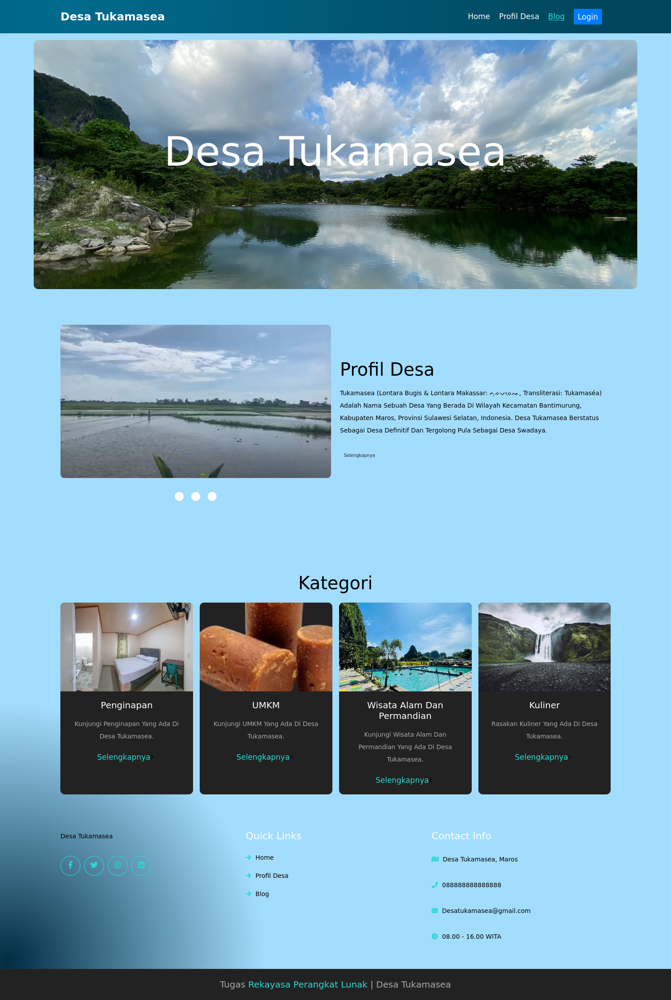
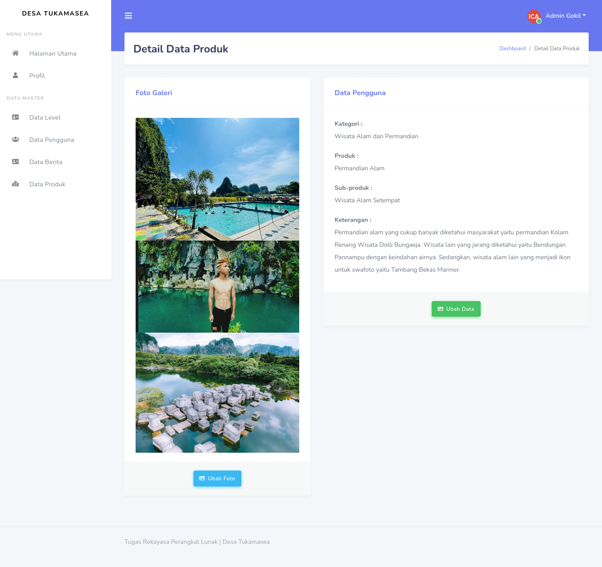

# Simple CSS and PHP Project

This is a simple project created to implement CSS and PHP in a simple case. The source
code contains a village profiles in Maros Regency, it is Tukamasea Village. There are
one main role in manage application (admin) and another as a visitor on to the website.

## Result Screenshot



## Some Bugs
Some bugs found while working with this project:
1. Didn't unlink the image file while perform deletion in application.
2. Unable to mass preview image while selecting files.
3. Login page is not eye catching.
4. Need to improve frontend appearance.

## Clone Repository
To clone, ensure `git` is installed on your device as well.

```bash
$ git clone https://github.com/muh-fajri/simple-css-php-project.git
```
Another way to get the repository, directly download zip file.

## Create Database
To run this project locally, assumed *Web Server* has been installed.
1. Create databases named `db_wisata`.
2. Import file `db_wisata.sql` in `simple-css-php-project` just cloned.
3. Copy folder `simple-css-php-project` in the directory that is running local *Web Server*.
4. Run localhost in web browser that is pointed to `simple-css-php-project` (`http://localhost/simple-css-php-project`).

If succeed, you can see the page like the screeshot above.

> **Catatan :**
> - You can change `simple-css-php-project` to any name you want.

Hopefully useful.